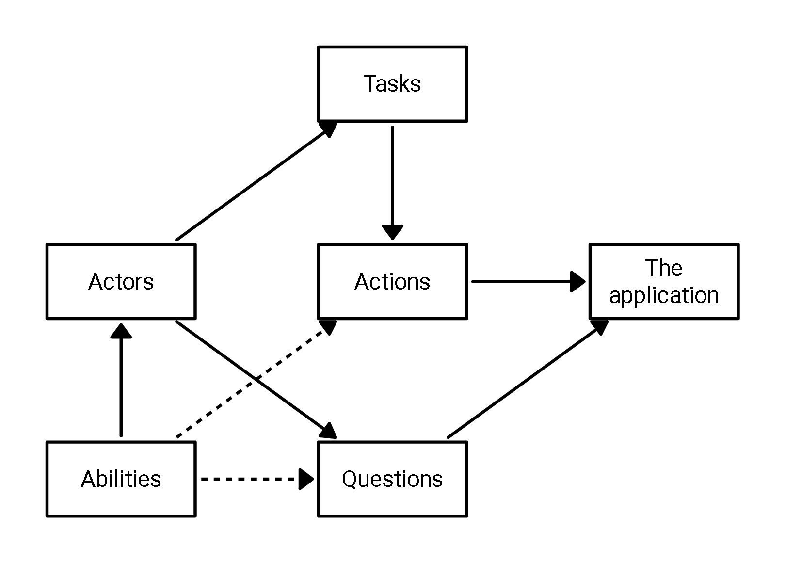

# CSF.Screenplay
**[Screenplay]**, formerly known as **Journey**, is a design pattern for writing BDD (Behaviour Driven Development) test code. Screenplay helps developers write high-value tests:

* The test code tells a story
* Tests are guided toward a focus on *the actors* who are using the software
* It works very well alongside Gherkin/SpecFlow *although they are by no means required*
* Screenplay test logic conforms to [SOLID design principles]
* Screenplay is ideal for controlling technologies such as **[Selenium] Web Driver**

[Screenplay]: https://www.infoq.com/articles/Beyond-Page-Objects-Test-Automation-Serenity-Screenplay
[SOLID design principles]: https://en.wikipedia.org/wiki/SOLID_(object-oriented_design)
[Selenium]: http://www.seleniumhq.org/

## Example of a test using Screenplay
This example is written using **NUnit** test markup but NUnit is not required to use screenplay.

```csharp
[ScreenplayFixture]
public class BuyGroceriesTests
{
  readonly ScreenplayContext ctx;

  public BuyGroceriesTests(ScreenplayContext ctx)
  {
    this.ctx = ctx;
  }

  [Test]
  public void JoeCanBuyEggs()
  {
    var joe = ctx.GetCast()
      .Get("Joe");
    var browseTheWeb = ctx
      .GetWebBrowsingAbility();
    joe.IsAbleTo(browseTheWeb);

    Given(joe)
      .WasAbleTo(SearchTheShop.ForGroceries());
    When(joe)
      .AttemptsTo(Click.On(GroceriesForSale.BuyEggsButton));
    var message = Then(joe)
      .ShouldSee(TheText.Of(GroceriesForSale.FeedbackMessage));

    Assert.That(message, Is.EqualTo("Thankyou for buying eggs."));
  }
}
```

## Anatomy of a Screenplay test
Screenplay tests start with **Actors**. Actors interact with the application via **Tasks** and query the state of the app with **Questions**.

Where a task represents a high-level interaction with the application, the building blocks from which they are composed are **Actions**. Each action represents a single interaction between an actor and the application, such as a mouse click.

Actions and questions interact with the application, but they do so via APIs provided by **Abilities** which the actor has been granted.



### Applied to the example above
In the example above, our **actor** is the variable `joe`.

Notice that we retrieved Joe from a **Cast**. A cast is an optional registry of the actors involved in a single test scenario. Secondly we grant Joe the **ability** to use a web browser.

The line beginning `Given` demonstrates the use of a **task** named `SearchTheShop`, specifically for groceries. Note how this high-level operation would be recognisable and immediately understandable to a non-developer. The task class encapsulates the sequence of actions which would be required to search the shop for groceries.

The `When` line demonstrates Joe directly using an **action** (in this case `Click`). This is unusual in Screenplay; usually you would wrap this within a task. For sake of demonstration though, it has been included to show how individual actions could be used just like tasks if desired.

Finally the `Then` line demonstrates a **question**, named `TheText`, which reads some text which is visible on the web page. The result is returned as the variable `message`.

The very last line doesn't really use screenplay at all. It is a standard NUnit assertion upon the result of the question.

## Learn more
* This project is inspired by [Serenity BDD] (for Java), which provides a screenplay implementation of its own

[Serenity BDD]: https://github.com/serenity-bdd
